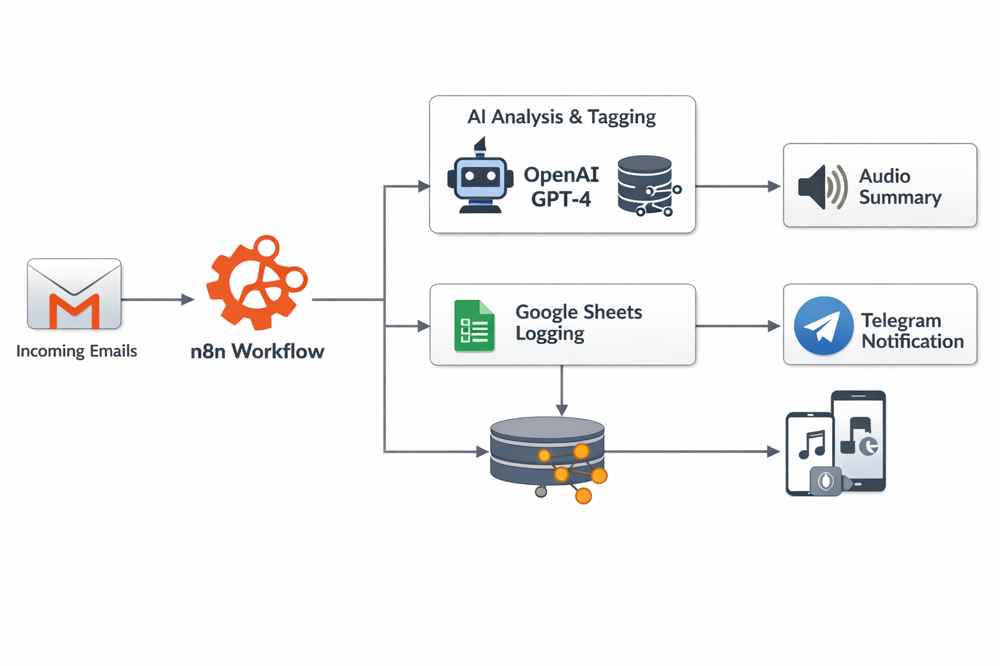

<h2>📧 AI Email Intelligence — Summarize, Classify & Learn with RAG</h2>

This workflow automatically reads incoming Gmail messages, analyzes them using AI with a retrieval-augmented
classification system (RAG), organizes emails into structured categories, stores results in Google Sheets,
and even generates an audio summary sent directly to Telegram.

<table>
  <tr>
    <td>
      
    </td>
    <td>
      
    </td>
  </tr>
</table>

<h2>⚙️ How It Works</h2>

The workflow creates an intelligent email processing pipeline combining Gmail, OpenAI, vector embeddings,
and Google Sheets to continuously learn and improve email categorization accuracy.

<ol>
<li>
<strong>Email Trigger</strong> 
The workflow starts automatically whenever a new email arrives in Gmail using the Gmail Trigger node.
</li>

<li>
<strong>Email Extraction & Cleaning</strong> 
The full email content, sender information, subject, and timestamp are retrieved and normalized.
HTML formatting is removed so the AI receives clean text data.
</li>

<li>
<strong>Knowledge Base Loading (RAG)</strong> 
Email tagging examples stored in a Google Sheets document are loaded and converted into embeddings.
These examples act as the official taxonomy for categories and subcategories.
</li>

<li>
<strong>Vector Store Creation</strong> 
The workflow builds an in-memory vector database containing historical tagging samples.
This allows semantic similarity search during classification.
</li>

<li>
<strong>AI Analysis Agent</strong> 
An OpenAI-powered AI Agent performs multiple tasks in a single step:
<ul>
<li>Summarizes the email (short paragraph)</li>
<li>Creates a one-line short message</li>
<li>Classifies the email using retrieved vector examples</li>
<li>Extracts keywords</li>
<li>Assigns confidence score</li>
<li>Detects whether a new category or subcategory was created</li>
</ul>

The agent strictly prioritizes retrieved taxonomy examples to maintain consistent labeling.
</li>

<li>
<strong>Structured Data Storage</strong> 
Processed email data — including summary, category, keywords, and metadata — is appended to a Google Sheets log,
creating a searchable email intelligence database.
</li>

<li>
<strong>Self-Learning Taxonomy</strong> 
If the AI determines a new category or subcategory is required:
<ul>
<li>The new label is automatically added to the tagging samples sheet</li>
<li>An admin notification is sent via Telegram</li>
</ul>
This allows the system to evolve over time.
</li>

<li>
<strong>Audio Summary Generation</strong> 
The summarized email text is converted into speech using OpenAI audio generation.
</li>

<li>
<strong>Telegram Notification</strong> 
The generated audio summary is automatically delivered to Telegram, allowing quick email review without reading.
</li>
</ol>

<h2>🧩 Features</h2>

<ul>
<li>✅ Fully automated Gmail monitoring</li>
<li>✅ Retrieval-Augmented Generation (RAG) email classification</li>
<li>✅ Consistent taxonomy enforcement via vector similarity</li>
<li>✅ Automatic keyword extraction & confidence scoring</li>
<li>✅ Self-updating category knowledge base</li>
<li>✅ Google Sheets email database</li>
<li>✅ AI-generated voice summaries</li>
<li>✅ Telegram admin notifications</li>
<li>✅ Continuously improving classification accuracy</li>
</ul>

<h2>🚀 Setup Steps</h2>

<h3>1. Required Accounts</h3>
<ul>
<li>Google account (Gmail + Google Sheets)</li>
<li>OpenAI API account</li>
<li>Telegram Bot</li>
<li>n8n instance (Cloud or Self-hosted)</li>
</ul>

<h3>2. Configure Credentials in n8n</h3>

Create the following credentials inside n8n:

<ul>
<li><strong>Gmail OAuth2</strong> – used by Gmail Trigger and message retrieval</li>
<li><strong>Google Sheets OAuth2</strong> – for email storage and taxonomy dataset</li>
<li><strong>OpenAI API</strong> – for embeddings, AI analysis, and audio generation</li>
<li><strong>Telegram API</strong> – for sending notifications and audio summaries</li>
</ul>

<h3>3. Prepare Google Sheets</h3>

<strong>Sheet 1 — Email Log</strong>

<ul>
<li>date</li>
<li>email</li>
<li>name</li>
<li>subject</li>
<li>summarized text</li>
<li>category</li>
<li>subcategory</li>
<li>keywords</li>
</ul>

<strong>Sheet 2 — Tagging Samples (Knowledge Base)</strong>

<ul>
<li>id</li>
<li>subject</li>
<li>email_text</li>
<li>category</li>
<li>subcategory</li>
<li>keywords</li>
</ul>

This sheet acts as the classification training reference used by the vector store.

<h3>4. Configure Telegram</h3>
<ul>
<li>Create a Telegram bot using BotFather</li>
<li>Copy the bot token into n8n credentials</li>
<li>Replace the <code>chatId</code> value with your Telegram user or group ID</li>
</ul>

<h3>5. Connect OpenAI</h3>
<ul>
<li>Add your OpenAI API key</li>
<li>Ensure access to chat models and embeddings</li>
<li>No additional configuration required</li>
</ul>

<h3>6. Activate the Workflow</h3>
<ul>
<li>Enable the workflow</li>
<li>Send a test email to your Gmail inbox</li>
<li>Verify that:
  <ul>
    <li>Email appears in Google Sheets</li>
    <li>Categories are assigned</li>
    <li>Audio summary arrives in Telegram</li>
  </ul>
</li>
</ul>

<h2>💡 Recommended Usage</h2>

<ul>
<li>Email triage automation</li>
<li>Customer support inbox classification</li>
<li>Sales lead categorization</li>
<li>Personal productivity systems</li>
<li>AI-assisted knowledge management</li>
</ul>

<h2>🧠 Architecture Notes</h2>

This workflow uses a Retrieval-Augmented Generation (RAG) pattern inside n8n by combining
Google Sheets as a lightweight knowledge base with an in-memory vector store.
Instead of relying purely on model reasoning, classification decisions are grounded
in previously approved examples, producing stable and explainable categorization.

Over time, the workflow becomes smarter as new categories are automatically added,
effectively turning your inbox into a continuously learning AI system.

